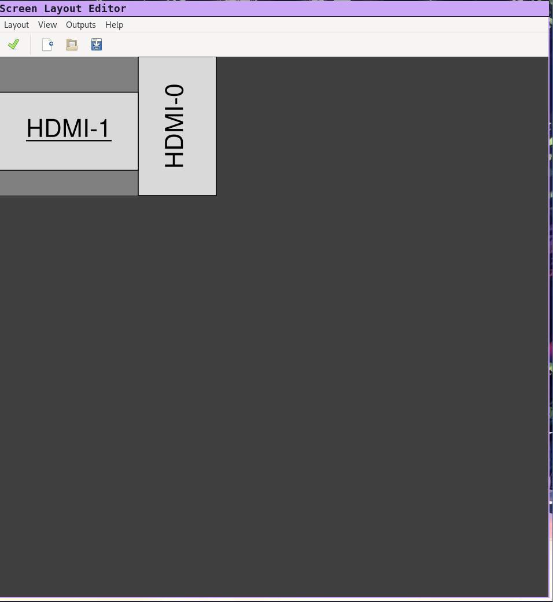
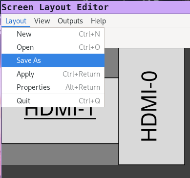
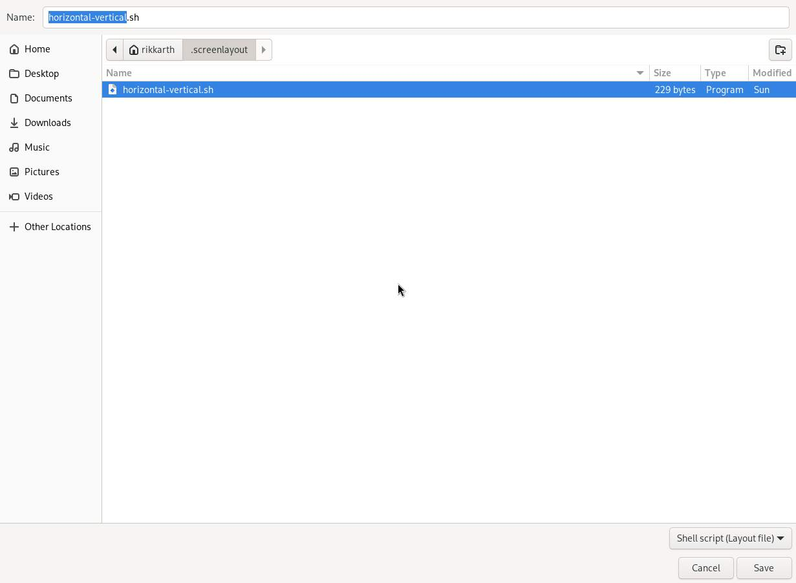

# Setup your monitors with XRandR and ARandR in i3

## Introduction

Setting up monitor positions in i3 can be a complex task due to the manual configuration required in the i3 window manager. Unlike traditional desktop environments that often provide graphical user interfaces for managing monitors, i3 relies on editing configuration files to define monitor layouts. 

The process involves specifying the position, resolution, and orientation of each monitor, which can be challenging for users unfamiliar with editing configuration files. Additionally, i3's focus on tiling window management adds another layer of complexity when arranging monitors, as windows are automatically tiled based on the defined layout. As a result, setting up monitor positions in i3 requires a good understanding of the configuration syntax and a willingness to experiment to achieve the desired setup.

In this tutorial, we will guide you through setting up i3 using XRandR and ARandR to configure monitor positions. These tools will help simplify the process by allowing you to manage monitor layouts more intuitively, making it easier to define monitor positions, resolutions, and orientations within the i3 window manager environment.

## 1 Installation

*This tutorial assumes you are currently running an Arch Linux installation and have i3 installed. This will nevertheless __work in virtually any linux distribution__.*

### 1.1 XRandR and ARandR

**XRandR documentation**: https://wiki.archlinux.org/title/Xrandr

**ARandR documentation**: https://christian.amsuess.com/tools/arandr/

```
sudo pacman -S xorg-xrandr && sudo pacman -S arandr
```

## 2 Configuration

### 2.1 ARandR configuration

#### 2.1.1 Setup your monitors
Type `arandr` in your terminal or run arandr through your graphical window manager (gnome, i3, other).

You should be able to configure your displays leveraging a simple yet efficient UI provided through **ARandR**.



#### 2.1.2 Save your configuration
Your configuration should be saved in `%HOME/.screenlayout` which is the default target location **ARandR** uses to save layout configurations.

**Note**: If you press `Apply`, **ARandR** will instantly apply the configured changes, but will not persist them on system restart. We will persist these changes through i3 configuration in the next steps.



*saving your configuration*


Your **ARandR** and **XRandR** configuration is done.

*the filename for this sample*
**Filename:** `horizontal-vertical.sh`

*output in `horizontal-vertical.sh`*
```bash
#!/bin/sh
xrandr --output HDMI-0 --mode 1920x1080 --pos 1920x0 --rotate right --output DP-0 --off --output DP-1 --off --output HDMI-1 --primary --mode 1920x1080 --pos 0x492 --rotate normal --output DP-2 --off --output DP-3 --off
```

If you know **XRandR** "syntax", you can now observe that **ARandR** abstracts and generates the code necessary through the GUI, making this process a lot simpler.

In the next step we will automate and execute this in the i3 configuration.

### 2.2 i3 Configuration

Now in our i3 config we just need to execute the display script, which will apply, automate and persist the display configuration generated by **ARandR**.

```bash
# This command sets up horizontal and vertical monitor configuration on startup
exec --no-startup-id ~/.screenlayout/horizontal-vertical.sh
```

After applying these changes, we just need to refresh i3 with `mod+Shift+r`.

You should now see your monitor setup correctly displayed.

**Note**: If you previously applied your configuration in [2.1.2 Save your configuration](#212-save-your-configuration), you will not observe any changes since you've already applied them before.
